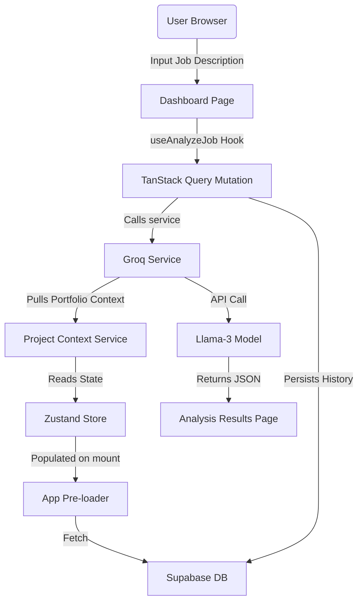

# Applied.AI — AI-Powered Career Intelligence Dashboard

Applied.AI is a modern, premium web application designed to bridge the gap between job descriptions and a candidate's portfolio. It automatically extracts key requirements from any job description, compares them against the candidate's custom projects (leveraging live LLM analysis or dynamic local matching), and generates tailored interview preparation questions.

## 🚀 Key Features

*   **AI Job Description Analyzer**: Paste any JD to instantly parse technical expectations (must-have vs. nice-to-have skills), compute an overall compatibility score, and receive targeted transition tips.
*   **Dynamic Portfolio Context**: A central project store that dynamically compiles and formats your portfolio data to act as context for the AI evaluations.
*   **Automated GitHub Import**: Connect a GitHub repository URL; the system reads your project structure and README file to automatically analyze and extract its tech stack and key features.
*   **Tailored Interview Preparation**: Dynamically generates targeted mock interview questions with hints and explanations based on the candidate's actual projects.
*   **Secure Authentication & Storage**: Integrated with **Supabase Auth** (email and Google OAuth) to support private, user-specific data storage and PostgreSQL database backups.
*   **Interactive History Logs**: Browse and search through your previous job analysis records on a dedicated history page.

---

## 🛠️ Tech Stack

### Frontend
*   **React 19**: Modern SPA library utilizing hook-based architectures.
*   **Vite**: Next-generation frontend tooling and fast development server.
*   **Tailwind CSS**: Utility-first styling for premium dark modes, layouts, and glassmorphic designs.
*   **Framer Motion**: Fluid, hardware-accelerated micro-animations.
*   **Lucide React**: Vector icons.

### State & Data Fetching
*   **Zustand**: Lightweight, persistent global store managing app-level UI and user portfolio states.
*   **TanStack React Query (v5)**: Declarative server-state caching and asynchronous mutation handlers.

### Backend & Database
*   **Supabase**: PostgreSQL backend service handling database management and secure user authentication.
*   **Row-Level Security (RLS)**: Enforces complete isolation between user sessions.

### Artificial Intelligence
*   **Groq SDK (Llama-3)**: Connects to high-performance inference engines (`llama-3.3-70b-versatile` / `llama-3.1-8b-instant`) for instant parser responses.
*   **Dynamic Local-Matching Fallback**: Automatically takes over using client-side matching rules when offline or in case of API limits.

---

## 💻 Installation & Local Setup

### 1. Clone the Repository
```bash
git clone https://github.com/Anjalikasoudhan/Applied-AI.git
cd Applied-AI
```

### 2. Install Dependencies
```bash
npm install
```

### 3. Setup Environment Variables
Create a `.env` file in the root directory and add the following keys:
```env
VITE_GROQ_API_KEY=your_groq_api_key
VITE_SUPABASE_URL=your_supabase_project_url
VITE_SUPABASE_ANON_KEY=your_supabase_anon_key
```

### 4. Run the Development Server
```bash
npm run dev
```
The app will run on `http://localhost:3000` (this port is pre-configured in `vite.config.js` to match the default Supabase OAuth redirect whitelist).

---

## 📐 Architecture



---

## 🔒 Security
All user data is private and secured using **Supabase Row-Level Security (RLS)**. The SQL queries below were used to configure security:
```sql
alter table public.user_projects enable row level security;

create policy "Users can view their own projects" 
  on public.user_projects for select 
  using (auth.uid() = user_id);

create policy "Users can insert their own projects" 
  on public.user_projects for insert 
  with check (auth.uid() = user_id);
```
